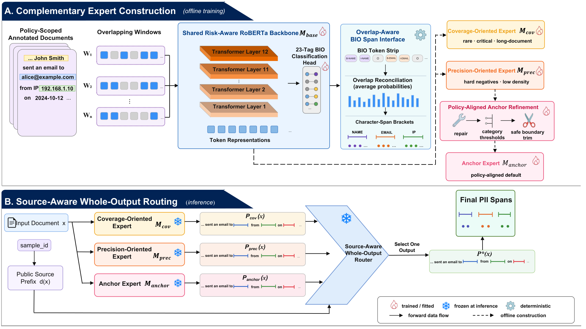

# UbiComp 2026 Workshop: Trustworthy Agentic AI (Track 2 - PII-PolicyBench)

**PRIOR：Policy- and Risk-Informed Whole-Output Expert Routing for Policy-Compliant
PII Detection**

PRIOR is the reproducible code release for our third-place PII-PolicyBench
Track 2 system. It combines risk-aware BIO tagging, complementary coverage and
precision experts, a policy-aligned anchor, and deterministic source-aware
whole-output routing.



## Result

The frozen system produced the following official hidden-test result on
638,204 documents:

| Metric | Result |
| --- | ---: |
| Policy Compliance Rate | **0.9663978916** |
| Weighted PII coverage | 0.9909503601 |
| Critical coverage | 0.9972596467 |
| False-positive character rate | 0.0024979195 |
| Missing / extra rows | 0 / 0 |
| Final rank | **3** |

The final submission contains 253,418,705 bytes and has SHA-256
`f12d15f65576871d42d6d9047ff9011d5a36a0e507f645d4bd6c893fcc30cef0`.

## Method

The code follows the four components described in the paper:

| Component | Implementation |
| --- | --- |
| Risk-Aware Span Tagging | `src/prior/risk_aware_span_tagging.py` |
| Complementary Expert Specialization | `src/prior/expert_specialization.py` |
| Policy-Aligned Anchor Refinement | `src/prior/anchor_refinement.py` |
| Source-Aware Whole-Output Expert Routing | `src/prior/whole_output_routing.py` |

The shared RoBERTa-base tagger uses 11 policy-scoped categories and a 23-tag
BIO schema. Risk and category weights shape the token loss. Coverage and
precision experts specialize from the same initialization using deterministic
curricula. Anchor refinement applies category thresholds, safe punctuation
trimming, exact deduplication, and deterministic ordering. The router then
selects one complete expert output per row; it never unions, edits, or relabels
spans after selection.

Supporting contracts are implemented in:

- `src/prior/schema.py`: labels, priorities, and risk constants;
- `src/prior/training.py`: deterministic training stages;
- `src/prior/validation.py`: row, schema, identity, and offset checks;
- `src/prior/policy_evaluation.py`: organizer-released PCR evaluation logic.

## Repository

```text
configs/       frozen model, training, routing, and artifact contracts
src/prior/     reusable method implementation
scripts/       training, inference, routing, reproduction, and validation CLIs
tests/         executable method and output-contract tests
```

Benchmark data, checkpoints, frozen predictions, and generated outputs are
excluded from Git and staged locally under `data/`, `artifacts/`,
`checkpoints/`, and `reproduction/`.

## Installation

Python 3.10 or newer is required. Exact submission reconstruction uses only the
standard library; neural training and inference require the optional model
dependencies.

```bash
python -m venv .venv
source .venv/bin/activate
pip install -e ".[model,dev]"
make test
```

The executed environment used Python 3.12.3, PyTorch 2.9.0, Transformers 5.2.0,
Tokenizers 0.22.2, and Safetensors 0.7.0. All included unit tests must pass.

## Data Contract

PRIOR consumes the official PII-PolicyBench JSONL files. Input rows contain
`sample_id` and `text`; labeled training rows additionally contain
`pii_annotations`. Only in-scope, positive-weight annotations from the 11
official PII categories become positive targets; `CONTEXT_MISC` is excluded.

Prediction rows contain `sample_id` and `pred_spans`. Every span uses
end-exclusive character offsets and one official category label:

```json
{"sample_id":"source:split:id","pred_spans":[{"start":0,"end":5,"label":"PERSON_NAME"}]}
```

Place the official files at `data/train.jsonl` and `data/test.jsonl`, or pass
explicit paths to the scripts. Data use and redistribution remain subject to
the benchmark terms.

## Exact Reproduction

The reported result is reconstructed from three frozen, row-aligned prediction
files and the fixed route in `configs/router.json`; it requires no GPU, hidden
labels, model inference, or test-time adaptation.

Download the Release archive `prior_frozen_predictions.tar.gz` and run:

```bash
mkdir -p artifacts/frozen
tar -xzf prior_frozen_predictions.tar.gz \
  --strip-components=1 -C artifacts/frozen
make reproduce
```

The archive is 81,976,454 bytes with SHA-256
`59d5195928f51bdffadd3ea75df691c3c9b0606b7468dc5b9ad80a8997b1d4ef`.
The expected filenames, sizes, and hashes are recorded in
`configs/artifacts.json`.

To additionally verify row order and character bounds against the official
test input:

```bash
make reproduce-with-test
```

The generated `reproduction/reproduction_report.json` must report
`"bitwise_identical": true` and `"strict_pass": true`. Expected routing facts
are 352,797 anchor rows, 284,746 precision rows, and 661 coverage rows.

## Training

From-scratch training does not require any PRIOR checkpoint. Use the official
challenge baseline model directory or a Transformers-compatible RoBERTa-base
model such as `FacebookAI/roberta-base` as `--model-dir`. Internet access is
needed only when that base model has not already been downloaded locally.

Create deterministic development and held-out splits, then build all five
leakage-filtered curricula:

```bash
PYTHONPATH=src python scripts/prepare_splits.py \
  --train-jsonl data/train.jsonl \
  --output-dir data/splits

PYTHONPATH=src python scripts/build_curricula.py \
  --train-jsonl data/train.jsonl \
  --exclude-jsonl data/splits/development.jsonl \
  --exclude-jsonl data/splits/heldout.jsonl \
  --output-dir data/curricula
```

The split rule is frozen in `configs/splits.json` and depends only on the seed
and `sample_id`, not file order. Curriculum construction emits shared
initialization, shared continuation, coverage, precision, and anchor-repair
JSONLs using deterministic sample ranks.

Run the complete training sequence on one GPU:

```bash
PYTHONPATH=src python scripts/train_all.py \
  --curricula-dir data/curricula \
  --model-dir artifacts/models/base_model \
  --output-dir checkpoints/prior \
  --devices 0
```

With two GPUs, coverage and precision training run concurrently after the
shared stages:

```bash
PYTHONPATH=src python scripts/train_all.py \
  --curricula-dir data/curricula \
  --model-dir artifacts/models/base_model \
  --output-dir checkpoints/prior \
  --devices 0,1
```

Completed checkpoints are reused automatically. Pass `--force` to retrain.
Individual stages remain available through `scripts/train.py`, including
`torchrun` distributed execution. Schedules are frozen in
`configs/training.json`.

## Inference and Routing

Run each checkpoint on both evaluation splits using `scripts/infer.py`. Store
the six files using this convention:

```text
reproduction/eval_predictions/{anchor,coverage,precision}/{development,heldout}.jsonl
```

Then evaluate the experts by public source and freeze a retrained router:

```bash
PYTHONPATH=src python scripts/evaluate_experts.py \
  --splits-dir data/splits \
  --predictions-dir reproduction/eval_predictions \
  --output reproduction/expert_audit.json \
  --router-output reproduction/router.json
```

For ordinary inference, supply the desired checkpoint directly:

```bash
PYTHONPATH=src python scripts/infer.py \
  --input-jsonl data/test.jsonl \
  --model-dir artifacts/models/base_model \
  --checkpoint checkpoints/prior/anchor_repair/checkpoint.pt \
  --mode anchor \
  --output-jsonl reproduction/anchor_predictions.jsonl
```

Use `--mode expert` for coverage and precision checkpoints or `--mode scored`
to retain decoded scores. Route newly trained, row-aligned test predictions
with the generated router:

```bash
PYTHONPATH=src python scripts/reproduce_submission.py \
  --anchor reproduction/test_predictions/anchor.jsonl \
  --coverage reproduction/test_predictions/coverage.jsonl \
  --precision reproduction/test_predictions/precision.jsonl \
  --router reproduction/router.json \
  --test-jsonl data/test.jsonl \
  --output reproduction/submission.jsonl \
  --report reproduction/submission_report.json
```

Without the three custom path arguments, the same script enters strict frozen
artifact mode and verifies the reported submission byte-for-byte.

## Reproducibility Scope

- Frozen prediction files and routing configuration reconstruct the submitted
  JSONL byte-for-byte.
- Frozen checkpoint inference follows the released tokenizer, sliding-window,
  overlap-averaging, BIO-decoding, and anchor-refinement implementation, but GPU
  kernels may introduce numerical differences.
- Neural retraining fixes seeds, curricula, schedules, weights, lengths,
  strides, and batch sizes but is not claimed to be bitwise deterministic.
- `configs/splits.json` defines a complete public retraining protocol for new
  experiments; it is not claimed to recover the unpublished historical order
  of every competition-era intermediate split.
- Training, development, fresh held-out, and hidden-test roles are separated;
  hidden labels are never used for fitting, calibration, or route selection.

## Limitations and Responsible Use

Routing assumes the public source prefix in `sample_id` remains stable; unseen
sources fall back to the anchor. Character offsets require unmodified input
text, and performance may vary across languages, domains, and policies. False
negatives can expose sensitive information, while false positives can remove
useful text. PRIOR is a research system, not a complete privacy guarantee;
high-impact use requires human review and downstream safeguards.

Do not commit raw benchmark data, private text, model artifacts, or generated
predictions containing sensitive information. Follow all benchmark and source
dataset terms.

## Citation

Citation metadata is provided in `CITATION.cff`. Venue details can be added
when the paper record is public.
